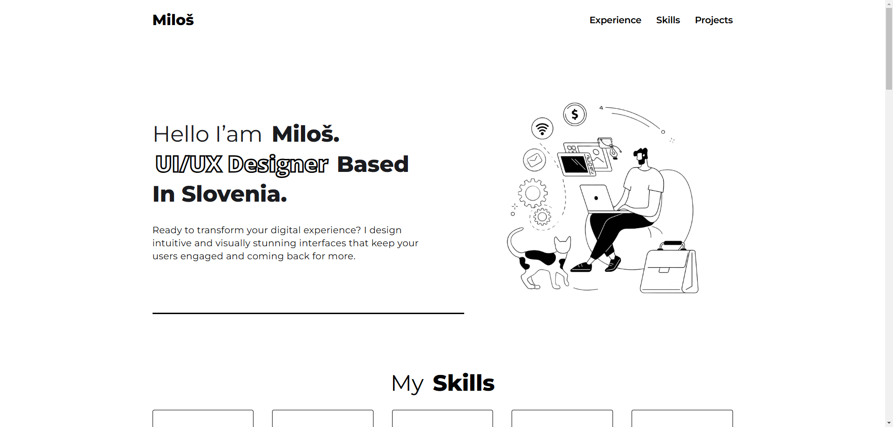
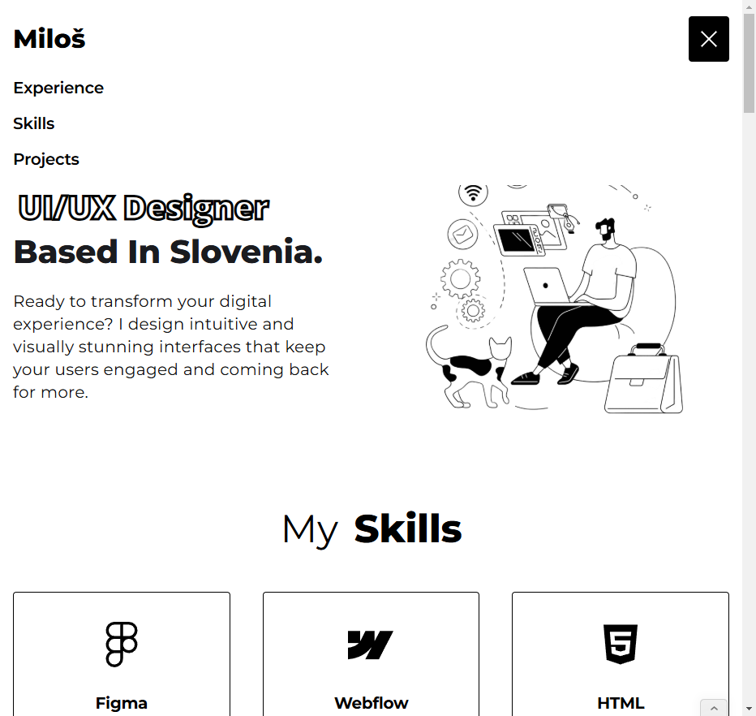
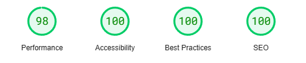
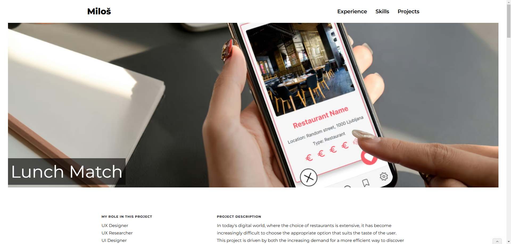

# Miloš UI/UX Design Portfolio 🚀
Welcome to my creative journey! 🌟 This is the official repository of Miloš UI/UX Design Portfolio! This portfolio showcases the design work, skills, and expertise of Miloš in the field of UI/UX design. It highlights various projects, design processes, and the creative journey behind building user-friendly and visually engaging interfaces.

 

# Project Overview
This portfolio was created to showcase Miloš's design projects, his UI/UX skills, and thought processes. It's built with modern web technologies, providing an intuitive user experience and aesthetic appeal.

It includes a range of UI/UX design projects, including case studies, wireframes, and design prototypes. The portfolio highlights the importance of user-centered design and the value of usability in creating seamless experiences.

Here's my portfolio! 😎

👉[Explore Portfolio](https://milos-ui-ux-design-portfolio.webflow.io/)

## Features 🌟
- Interactive and responsive design: Ensures an optimal experience across all devices, including desktop, tablet, and mobile.
- Project showcase: A variety of UI/UX design projects with detailed case studies and descriptions.
- Clean, modern aesthetic: Simple yet effective visuals that focus on showcasing design work.
- User-friendly navigation: Easy-to-navigate sections for smooth browsing.
- Portfolio highlights: Displays skills in wireframing, prototyping, and user research.

## Technologies Used ⚙️
- **Webflow:** The platform used to design and host the portfolio.
- **HTML/CSS:** Custom code for structure and styling.
- **JavaScript:** Used for some interactive elements to enhance user experience.
- **Figma:** Tool used for designing and prototyping.

## Responsive Design 📱💻
Responsive design principles, such as fluid grids, flexible images, and media queries, are employed to ensure that the website offers an optimal viewing experience regardless of device type. This approach enhances usability and allows users to access the portfolio from anywhere, at any time.

 

## Performance 🚀
The portfolio is optimized for fast load times, featuring:
- Image compression and lazy loading for quick content delivery.
- Minified CSS and JavaScript to reduce file sizes.
- Browser caching for faster repeat visits.

## Accessibility ♿
Accessibility is key, with features such as:
- Semantic HTML5 for screen reader compatibility.
- Keyboard navigation and alt text for images for inclusivity.
- High color contrast and a responsive design for better visibility across devices.

## Best Practices 💡
Modern web development best practices include:
- Mobile-first design and cross-browser compatibility.
- Clean, organized code for maintainability.
- Security measures like SSL encryption for data protection.

## SEO (Search Engine Optimization) 📈
SEO best practices ensure better visibility with:
- Optimized meta tags and semantic HTML for better search engine understanding.
- Responsive design and SEO-friendly URLs for mobile-friendliness.
- Fast load times and alt text for images to enhance rankings.

## Website Score 📊
You can check the performance and SEO scores of the website using tools like Google PageSpeed Insights, Lighthouse, and others. These scores will help track the efficiency and areas for improvement.

 

## Other Pages
Explore other pages and check out my UI/UX Design products and case studies.

 

 

# Contact 📬
Feel free to get in touch for inquiries, collaboration opportunities, or feedback.

- Email: milosstankovic2002@gmail.com
- [Connect with me on LinkedIn](https://www.linkedin.com/in/milos-stankovic25/)
